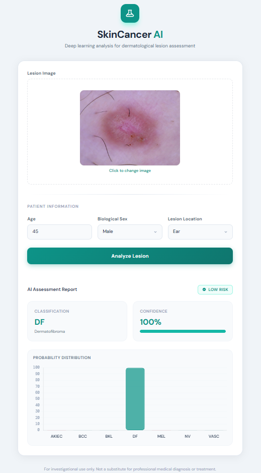

# SkinCancer AI 🔬

[](https://github.com/asifahamed11/skin-lesion-classifier/actions/workflows/ci.yml)
[](https://www.python.org/downloads/)
[](https://www.tensorflow.org/)
[](https://flask.palletsprojects.com/)
[](LICENSE)

A deep-learning web application that classifies skin lesion images into **7 HAM10000 categories** using a fine-tuned MobileNet backbone. It includes a gatekeeper model that rejects non-skin images before the main classifier runs.

> ⚠️ **For investigational / educational use only.** Not a substitute for professional medical diagnosis or treatment.

---

## Features

- **7-class lesion classification** — MEL, NV, BCC, AKIEC, BKL, DF, VASC
- **Gatekeeper filter** — Rejects non-skin images before classification
- **Multi-input support** — Optional patient metadata (age, sex, lesion location) fed to a second model input
- **Interactive UI** — Drag-and-drop image upload, real-time probability bar chart (Chart.js), confidence meter
- **REST API** — `/predict`, `/health`, `/api/classes` endpoints
- **Docker-ready** — Single `docker build` + `docker run` deployment

---

## Demo



|             Upload & Analyze             |                    Result Report                    |
| :--------------------------------------: | :-------------------------------------------------: |
| Drag-and-drop image + enter patient info | Bar chart with per-class probabilities + risk badge |

---

## Lesion Classes

| Code    | Full Name                           | Risk        |
| ------- | ----------------------------------- | ----------- |
| `mel`   | Melanoma                            | 🔴 HIGH     |
| `akiec` | Actinic Keratoses / Bowen's Disease | 🔴 HIGH     |
| `bcc`   | Basal Cell Carcinoma                | 🟡 Moderate |
| `bkl`   | Benign Keratosis                    | 🟢 Low      |
| `nv`    | Melanocytic Nevi                    | 🟢 Low      |
| `df`    | Dermatofibroma                      | 🟢 Low      |
| `vasc`  | Vascular Lesion                     | 🟢 Low      |

---

## Project Structure

```
skincancer-ai/
├── app.py                                # Flask application (routes + inference logic)
├── templates/
│   └── index.html                        # Single-page UI (Tailwind CSS + Chart.js)
├── static/
│   └── favicon.svg                       # App favicon
├── gatekeeper_model.keras                # Binary skin/not-skin classifier
├── skin-cancer-7-classes_MobileNet_ph1_model.keras  # Phase-1 trained model
├── MobileNet.h5                          # Fallback image-only model
├── skin-cancer-7-classes_sex_encoder.pkl # LabelEncoder for sex feature
├── skin-cancer-7-classes_loc_encoder.pkl # LabelEncoder for localization feature
├── skin-cancer-7-classes_age_scaler.pkl  # StandardScaler for age feature
├── tests/
│   ├── __init__.py
│   └── test_routes.py                    # pytest route tests (CI)
├── requirements.txt
├── Dockerfile
├── .github/
│   └── workflows/
│       └── ci.yml                        # GitHub Actions CI
└── LICENSE
```

---

## Quick Start

### 1 — Clone & install

```bash
git clone https://github.com/asifahamed11/skin-lesion-classifier.git
cd skin-lesion-classifier

python -m venv .venv
# Windows:
.venv\Scripts\activate
# macOS/Linux:
source .venv/bin/activate

pip install -r requirements.txt
```

### 2 — Run

```bash
python app.py
```

Open **http://localhost:5000** in your browser.

---

## Docker

```bash
# Build
docker build -t skincancer-ai .

# Run
docker run -p 5000:5000 skincancer-ai
```

---

## API Reference

### `GET /health`

Returns the current model loading status.

```json
{
  "status": "ok",
  "model_loaded": true,
  "model_file": "skin-cancer-7-classes_MobileNet_ph1_model.keras",
  "gatekeeper_loaded": true,
  "preprocessors_loaded": true,
  "model_expects_tabular": true
}
```

---

### `GET /api/classes`

Returns all supported lesion classes plus available form options.

```json
{
  "classes": ["bkl", "nv", "df", "mel", "vasc", "bcc", "akiec"],
  "classes_full": { "mel": "Melanoma", ... },
  "dangerous_classes": ["mel", "akiec"],
  "sex_options": ["female", "male", "unknown"],
  "localization_options": ["abdomen", "acral", "back", ...]
}
```

---

### `POST /predict`

**Content-Type:** `multipart/form-data`

| Field          | Type       | Required | Description                        |
| -------------- | ---------- | -------- | ---------------------------------- |
| `file`         | image file | ✅       | JPEG / PNG skin lesion image       |
| `age`          | number     | ✅       | Patient age (0–120)                |
| `sex`          | string     | —        | `male` / `female` / `unknown`      |
| `localization` | string     | —        | Body location (see `/api/classes`) |

**Success response:**

```json
{
  "predicted_class": "nv",
  "predicted_class_full": "Melanocytic Nevi",
  "confidence": 87.34,
  "is_dangerous": false,
  "all_probabilities": {
    "bkl": 4.21, "nv": 87.34, "df": 1.05,
    "mel": 3.88, "vasc": 0.62, "bcc": 1.73, "akiec": 1.17
  },
  "class_names_full": { ... },
  "gatekeeper": {
    "enabled": true,
    "passed": true,
    "skin_probability": 97.6,
    "threshold": 50.0
  }
}
```

**Gatekeeper rejection (non-skin image):**

```json
{
  "predicted_class": "not_skin",
  "predicted_class_full": "Not a skin lesion image",
  "confidence": 91.5,
  "is_dangerous": false,
  "gatekeeper": {
    "enabled": true,
    "passed": false,
    "skin_probability": 8.5,
    "threshold": 50.0
  }
}
```

---

## Model Architecture

The main model is a **MobileNet** (ImageNet-pretrained) fine-tuned in two phases on the [Skin Cancer Dataset](https://www.kaggle.com/datasets/farjanakabirsamanta/skin-cancer-dataset):

| Phase   | Description                                        |
| ------- | -------------------------------------------------- |
| Phase 1 | Classifier head trained, MobileNet backbone frozen |
| Phase 2 | Full model unfrozen, fine-tuned end-to-end         |

The optional **multi-input** variant concatenates a patient metadata vector (one-hot encoded sex + localization, scaled age) with the CNN feature map before the final dense layers.

The **gatekeeper** is a lightweight binary classifier trained to distinguish skin lesion images from unrelated photographs, preventing nonsensical predictions.

All images are resized to **224 × 224 RGB** before inference. Pixel values are passed without additional normalization (the model includes its own preprocessing layers).

---

## Environment Variables

| Variable                | Default       | Description                                      |
| ----------------------- | ------------- | ------------------------------------------------ |
| `FLASK_ENV`             | `development` | Set to `production` for deployment               |
| `TF_CPP_MIN_LOG_LEVEL`  | `0`           | Set to `2` to suppress TF C++ logs               |
| `TF_ENABLE_ONEDNN_OPTS` | `1`           | Set to `0` to disable oneDNN (reduces log noise) |

---

## Contributing

1. Fork the repo and create a feature branch: `git checkout -b feature/my-feature`
2. Make your changes and ensure `flake8 app.py --max-line-length=120` passes
3. Commit with a descriptive message: `git commit -m "feat: add XYZ"`
4. Open a Pull Request — the CI pipeline will run automatically

---

## License

Distributed under the [MIT License](LICENSE).

---

## Acknowledgements

- [Skin Cancer Dataset](https://www.kaggle.com/datasets/farjanakabirsamanta/skin-cancer-dataset) — Farjana Kabir Samanta, Kaggle
- [MobileNet](https://arxiv.org/abs/1704.04861) — Howard et al., Google
- [TensorFlow / Keras](https://www.tensorflow.org/)
- [Chart.js](https://www.chartjs.org/) — probability distribution chart
- [Tailwind CSS](https://tailwindcss.com/) — UI styling
